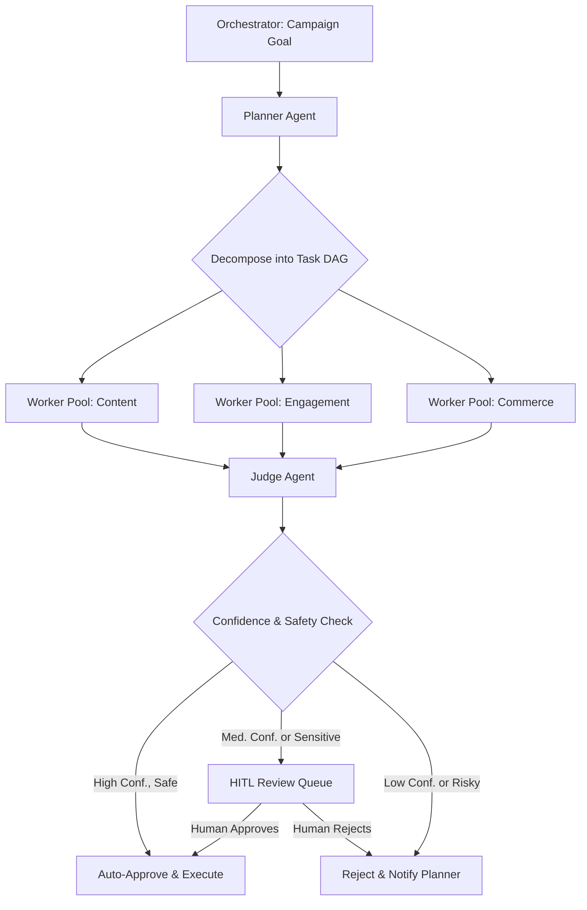
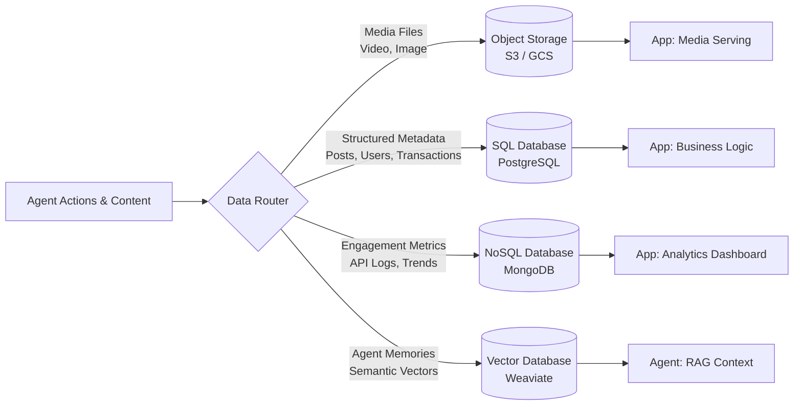
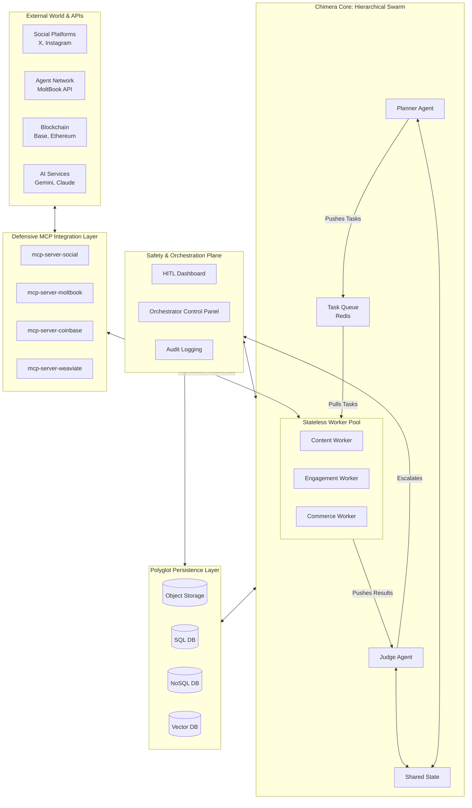

# Project Chimera: Domain Architecture Strategy  
**Document Version:** 1.0  
**Last Updated:** 2026-02-04  
**Owner:** FDE Trainee, Project Chimera  
**Status:** Ratified ✅  

> **📊 Viewing Mermaid Diagrams:** This document contains Mermaid diagrams that visualize the architecture.  
> - **GitHub**: Diagrams render automatically when viewing on GitHub  
> - **VS Code/Cursor**: Install "Mermaid Preview" extension, then press `Ctrl+Shift+V` to preview  
> - **Online**: Copy code blocks to [Mermaid Live Editor](https://mermaid.live/)  

---

## 1. Executive Summary
Mermaid Preview
This architecture strategy translates the strategic imperatives from Task 1.1 into a robust, scalable technical blueprint for Project Chimera. Our research reveals a market transitioning from AI-assisted tools to **autonomous, networked agent ecosystems** (a16z, OpenClaw, MoltBook), but one rife with security vulnerabilities and scalability challenges. The Chimera SRS defines our mission: to build a factory for **economically sovereign AI influencers**.  

This document mandates a **hierarchical swarm architecture** (Planner-Worker-Judge) to manage complexity, a **tiered Human-in-the-Loop (HITL) safety layer** integrated at the Judge to mitigate ecosystem risks, and a **polyglot persistence strategy** that aligns data stores with specific access patterns. The system will be **MCP-native**, ensuring all external interactions—including those with the volatile OpenClaw/MoltBook networks—are standardized, observable, and defensible. This architecture is designed to scale to thousands of agents while enforcing the cost controls, multi-tenancy, and financial governance required for a commercial platform.

---

## 2. Foundational Decisions & Rationale

### 2.1 Agent Pattern: Hierarchical Swarm (FastRender Planner-Worker-Judge)

**Decision:**  
We will implement a **Hierarchical Swarm** pattern based on the **FastRender model**, consisting of three specialized agent roles: **Planner**, **Worker**, and **Judge**.

**Why This Pattern?**
1.  **Manages Campaign Complexity:** A monolithic agent cannot reliably orchestrate the multi-step, parallel workflows of a modern content campaign (trend analysis → ideation → multi-modal asset generation → cross-platform publishing → engagement → commerce). The swarm decomposes this into discrete, manageable tasks.
2.  **Enables Parallelism & Scale:** Independent tasks (e.g., image generation, caption writing, wallet balance checks) are executed simultaneously by specialized Workers. This enables horizontal scaling and meets the SRS requirement for a "fleet of thousands."
3.  **Embeds Quality & Safety by Design:** The dedicated **Judge** agent is a first-class, non-negotiable component. It acts as a mandatory checkpoint for all outputs, providing the primary defense against poor quality, brand misalignment, and the security threats (prompt injection, malicious instructions) endemic to agent networks like MoltBook.
4.  **Aligns with the AI-Native Workflow:** This pattern directly mirrors the "Plan → Code → Review" paradigm shift identified in the a16z article. The Planner *plans* the strategy, the Workers *code/execute* the tasks, and the Judge *reviews* the output—a proven model for complex, AI-driven creation.

**Connection to Task 1.1 Research:**
*   **SRS Compliance:** This is a direct implementation of the mandated FastRender Swarm (SRS Section 3.1).
*   **Security Posture:** The Judge is our architectural response to the **credential leaks and prompt injection campaigns** documented in the OpenClaw ecosystem. All external inputs must pass through this governance layer.
*   **Market Evolution:** Specialization (Planner, Worker, Judge) mirrors the specialized tool layers (planning, code gen, review) defining the new AI software stack.

**Architectural Flow:**

### 2.2 Human-in-the-Loop (HITL): Tiered Safety Framework at the Judge

**Decision:**  
HITL is implemented as a **dynamic, criteria-driven framework at the Judge agent's decision point**. It is the final governance layer before any agent action affects the world.

**Why This Model?**
1.  **Enables Fractal Orchestration:** It operationalizes the SRS principle of "Management by Exception." The human Super-Orchestrator is only alerted for tasks that fall outside pre-defined thresholds, making it possible for a small team to oversee thousands of agents.
2.  **Applies Proportional Risk Management:** It recognizes that not all actions carry equal risk. The framework routes tasks based on **confidence scores** (LLM-generated) and **sensitivity filters** (keyword/semantic), ensuring an appropriate level of scrutiny.
3.  **Creates a Single, Auditable Choke Point:** Concentrating approval logic at the Judge ensures consistent application of safety, brand voice, and compliance rules. Every action, approval, and override is logged to a tamper-proof audit trail, which is critical for debugging and regulatory compliance (e.g., EU AI Act).

**Connection to Task 1.1 Research:**
*   **Mitigates Ecosystem Risks:** The **mandatory HITL escalation for financial transactions and sensitive topics** is a direct, non-negotiable response to the catastrophic security failures observed in OpenClaw.
*   **SRS Specification:** This implements the dynamic confidence scoring (0.0-1.0) and escalation logic detailed in SRS Section 5.1.

### 2.3 Data Persistence: Polyglot Strategy

**Decision:**  
We reject a monolithic database. A **polyglot persistence layer** will be implemented, selecting the optimal storage technology for each distinct data type and access pattern.

**Why Polyglot Persistence?**
1.  **Performance & Cost Optimization:** Each data type has unique requirements. Using specialized stores is more efficient and cost-effective than forcing a one-size-fits-all solution.
2.  **Architectural Alignment with Data Reality:**
    *   **Media Assets (Video/Image):** Large binaries → **Object Storage (AWS S3/GCP Cloud Storage)**.
    *   **Structured Metadata:** Transactions, relationships → **SQL Database (PostgreSQL)** for ACID compliance.
    *   **High-Velocity Metrics/Logs:** Flexible schema, fast writes → **NoSQL Database (MongoDB)**.
    *   **Agent Memory & Context:** Semantic search → **Vector Database (Weaviate)** – an SRS mandate.
3.  **Scalability:** This design allows each component to scale independently, which is essential for supporting a large fleet of content-generating agents.

**Connection to Task 1.1 Research:**
*   **SRS Directives:** The SRS explicitly names Weaviate for semantic memory and PostgreSQL for transactional data, validating this approach.
*   **Operational Requirement:** Handling "high-velocity video metadata" requires separating bulky media files from queryable metadata. Storing videos in a database would be a fatal scaling flaw.

**Data Flow Diagram:**

---

## 3. System Architecture Overview

The following diagram synthesizes all foundational decisions into a coherent system view, highlighting the defensive, MCP-centric integration layer.

**Key Architecture Justifications:**
1.  **MCP as the Universal Bridge:** All external capabilities are accessed via versioned MCP servers. This contains the volatility of social media APIs and the risks of agent networks within a standardized, observable interface. The `mcp-server-moltbook` is our secure, governed gateway to the agent social network.
2.  **Defensive Perimeter:** The data flow enforces security: Input from MoltBook (A2) → MCP Server (B2) → Worker (C3) → Judge (C2). **No external input can cause an action without Judge validation.** This is our primary defense against prompt injection.
3.  **Swarm Runtime Isolation:** Workers are stateless and ephemeral, scaling horizontally from a central queue. This provides resilience and cost-efficiency.
4.  **Centralized Governance:** The Safety Plane (D) monitors and can intervene at the swarm level (Orchestrator) or task level (HITL Dashboard), with full audit capability (D3).

---

## 4. Implementation Roadmap & Next Steps

This architecture directly informs the subsequent tasks in the 3-Day Roadmap, providing the technical blueprint for implementation.

### **Phase 1: Core Swarm & Governance (Aligns with Day 2 & 3 Tasks)**
*   **Task 2.1 (Master Specification):** The `specs/technical.md` will define the exact JSON-RPC APIs for Planner-Worker-Judge communication and the schema definitions for each database in the polyglot layer.
*   **Task 2.3 (Tooling & Skills):** We will draft the first Skill interfaces (e.g., `skill_generate_image`, `skill_analyze_trend`) for Workers. The `mcp-server-moltbook` will be specified as a priority development target.
*   **Task 3.1 (TDD):** Failing tests will be written for the Judge's confidence-scoring logic and for the input/output contracts of the core MCP servers.
*   **Task 3.2 (Containerization):** Dockerfiles will be created for each swarm role (Planner, Worker, Judge) and for core, long-running MCP servers.

### **Phase 2: Secure Integration (Post-Foundation)**
*   Develop and harden the `mcp-server-moltbook`, implementing OAuth flows, request signing, and input sanitization.
*   Implement the **"CFO" Judge** sub-agent with logic to enforce budget policies and validate transaction patterns using Coinbase AgentKit.
*   Build the operational **HITL Dashboard** (likely a lightweight FastAPI/React app) for the human review queue.

### **Phase 3: Scaling & Optimization**
*   Implement auto-scaling for the Worker pool based on Redis queue depth.
*   Add advanced caching (Redis) for frequently accessed memories and media metadata.
*   Develop comprehensive analytics within the Orchestrator Dashboard for fleet health and campaign ROI.

---
## 5. Conclusion

This architecture is not a theoretical exercise. It is a direct, reasoned translation of the **Project Chimera SRS** and the market, security, and technical realities uncovered in Task 1.1 research. By adopting a **Hierarchical Swarm**, a **Judge-centric HITL framework**, and a **Polyglot Persistence** model, all connected via **MCP**, we create a system that is capable of achieving commercial-scale autonomous influence while being armored against the severe risks of the emerging agent ecosystem. This document serves as the authoritative technical blueprint for all subsequent specification and development work.

---
**Deliverable Status:** ✅ **COMPLETE**  
This `research/architecture_strategy.md` document satisfies all requirements for Task 1.2.  
**Next Action:** Proceed to **Task 1.3: The "Golden" Environment Setup** to initialize the Git repository and connect the MCP Sense telemetry.