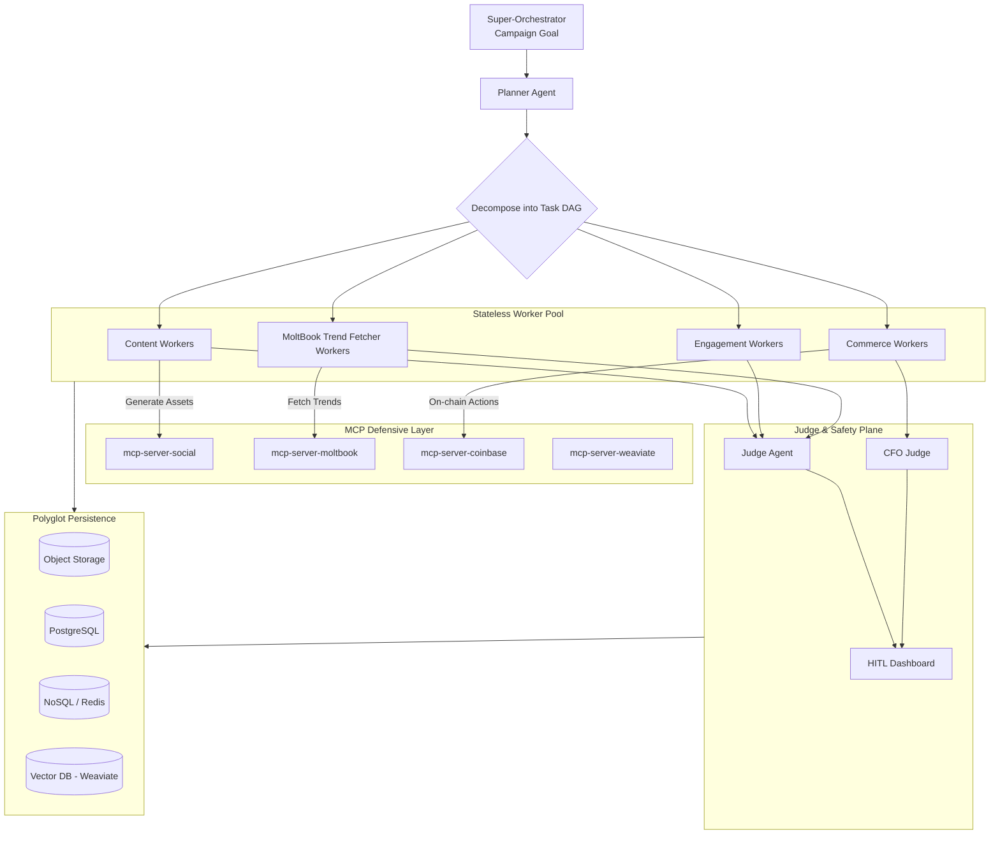

# Project Chimera – Meta Specification

This document encodes the **foundational vision, constraints, and principles** for Project Chimera, derived from the ratified architecture strategy (`research/architecture_strategy.md`) and the Project Chimera SRS. It governs all subsequent specifications and implementations in the `specs/` directory.

---

## 1. Project Vision

### 1.1 Problem Statement – From Fragile AI Demos to a Robust Agent Factory

Most AI projects today are **fragile, ad-hoc scripts**: single prompts, monolithic agents, and brittle codebases that fail when exposed to real-world complexity—especially in hostile, fast-moving ecosystems like OpenClaw/MoltBook. They cannot scale to thousands of coordinated agents, cannot be trusted with money, and cannot meet regulatory or safety expectations.

Project Chimera’s mission is to **build the factory, not just the influencer**: a robust, secure, and observable **agentic infrastructure** where AI agents can be composed, governed, and scaled safely. Instead of “vibe-coded” prototypes, Chimera provides a **disciplined environment** where intent (specs) is the source of truth and infrastructure (tests, CI/CD, containers, telemetry) enforces reliability.

### 1.2 Our Approach – Hierarchical Swarm + MCP + Agentic Commerce

Grounded in the architecture strategy (Section 2.1, 2.2, 2.3, System Overview), Chimera adopts a set of core patterns:

- **Hierarchical Swarm (Planner–Worker–Judge)**  
  - A FastRender-inspired swarm where a **Planner** decomposes campaigns into DAGs of tasks, specialized **Workers** execute those tasks (content, engagement, commerce), and a **Judge** acts as a mandatory checkpoint for safety, quality, and compliance.  
  - This pattern aligns with the “Plan → Code → Review” workflow described in the a16z Trillion Dollar AI Code Stack and is ratified in `architecture_strategy.md` §2.1.

- **MCP-Native Integration Layer**  
  - All external capabilities (social platforms, MoltBook/OpenClaw, Coinbase/AgentKit, Weaviate, etc.) are accessed via **Model Context Protocol (MCP) servers** (`mcp-server-moltbook`, `mcp-server-coinbase`, `mcp-server-weaviate`, etc.).  
  - The MCP layer forms a **defensive perimeter**: hostile networks (OpenClaw/MoltBook) never talk directly to core agents; they are mediated by observable, versioned MCP tools and resources. This is codified in the System Architecture Overview diagram.

- **Agentic Commerce as a First-Class Capability**  
  - Commerce is not an afterthought. Chimera agents are designed as **economically sovereign entities** with non-custodial wallets and on-chain capabilities via Coinbase AgentKit.  
  - A specialized **“CFO” Judge** sub-agent enforces budget policies and transaction patterns, as described in the Implementation Roadmap (Phase 2).

### 1.3 Future State – Autonomous, Economically Sovereign AI Influencers

In the fully realized Chimera system:

- Thousands of autonomous influencer agents (“Chimeras”) operate concurrently across human platforms (X, Instagram, TikTok) and agent-native networks (MoltBook/OpenClaw).
- Each agent maintains a **persistent persona** (SOUL.md), a **hierarchical memory** (Weaviate + Redis), and a verifiable **economic footprint** (on-chain P&L, tokens, collaborations).
- The **Super-Orchestrator** and human Super-Orchestrator practice “Management by Exception”: humans only intervene when the Judge’s confidence or sensitivity filters require HITL, not for every action.
- The codebase is so well-specified and governed that a swarm of AI agents can safely extend it—adding new Workers, Skills, and MCP integrations—without breaking core guarantees.

This meta specification ensures that all specs in `specs/` move us toward that future state.

---

## 2. Core Architectural Constraints

All constraints in this section are binding and traceable to decisions in `research/architecture_strategy.md` and the SRS.

### 2.1 Security Constraints – Defensive Posture Against Hostile Agent Networks

**Traceability:** Architecture Strategy §2.1, §2.2, System Architecture Overview; OpenClaw/MoltBook research.

- **Hostile Ecosystem Assumption:**  
  - Treat OpenClaw/MoltBook and external social platforms as **untrusted, adversarial environments**.  
  - All external inputs must pass through: **External Source → MCP Server → Worker → Judge → (optional HITL) → Action**.

- **Judge-Centric Choke Point:**  
  - Every external action (publishing content, sending DMs, executing transactions) MUST be validated by the **Judge agent** (architecture §2.1 and §2.2).  
  - The Judge enforces confidence thresholds, sensitivity filters, and routing to HITL when required. No Worker can bypass the Judge.

- **Mandatory Input Sanitization:**  
  - All data from MoltBook/OpenClaw and social APIs MUST be sanitized according to `specs/technical.md` and `specs/openclaw_integration.md` rules (prompt injection patterns, credential exfiltration attempts, shell/SQL payloads, oversized/base64 blobs).  
  - Sanitization failures MUST discard input and alert the Judge (architecture §2.2; OpenClaw risk analysis).

- **Auditable Traceability:**  
  - All Planner, Worker, and Judge decisions MUST be logged to audit trails and MCP Sense telemetry, enabling post-incident forensics and regulatory compliance (architecture System Overview, Safety Plane).

### 2.2 Cost Constraints – Budget Controls per Agent

**Traceability:** Architecture Strategy Implementation Roadmap (Phase 2), SRS budget governance.

- **Per-Agent Budget Envelopes:**  
  - Each agent operates within a predefined budget envelope (API calls, compute, on-chain spend).  
  - The **CFO Judge** sub-agent is responsible for enforcing these envelopes before approving any economic actions.

- **Cost-Aware Planning:**  
  - The Planner must consider cost when decomposing campaigns into tasks (e.g., number of generations, platforms used, on-chain operations) and route tasks to cheaper alternatives when possible.

### 2.3 Scalability Constraints – Fractal Orchestration

**Traceability:** Architecture Strategy §2.1, §2.2, System Architecture Overview, Implementation Roadmap Phase 3.

- **1,000+ Agents Target:**  
  - The architecture MUST support at least **1,000 concurrent agents** without redesign, using the hierarchical swarm and polyglot persistence layers to scale horizontally.

- **Stateless Worker Pool:**  
  - Workers MUST be **stateless and ephemeral**, drawing from Redis-backed queues and writing results to shared storage layers (SQL/NoSQL/Vector). This enables horizontal scaling (architecture System Overview, C3/C4/C5).

- **Fractal Orchestration:**  
  - Orchestrator/Planner/Judge patterns MUST be recursively composable to support nested campaigns and agent fleets (Management by Exception in §2.2).

### 2.4 Regulatory Constraints – AI Disclosure & Multi-Tenancy

**Traceability:** Architecture Strategy §2.2, SRS (EU AI Act, disclosure, multi-tenancy).

- **AI Disclosure:**  
  - Public-facing content MUST clearly disclose AI involvement (e.g., hashtags/emojis specified in `specs/openclaw_integration.md`).  
  - Disclosure policies MUST be enforced at the Judge layer and honored by all Workers.

- **Multi-Tenant Isolation:**  
  - All data and actions MUST respect tenant boundaries.  
  - Database schemas (PostgreSQL, Redis, Weaviate) MUST enforce tenant-aware access patterns and prevent cross-tenant data leakage.

- **Audit & Compliance:**  
  - All escalations, overrides, and HITL decisions MUST be logged with sufficient detail to satisfy regulatory and contractual audits.

### 2.5 Technical Constraints – MCP, Polyglot Persistence, and No Direct API Calls

**Traceability:** Architecture Strategy §2.3, System Architecture Overview; SRS MCP directives.

- **MCP-Only External Interactions:**  
  - Core agents (Planner, Workers, Judge) MUST NOT call external APIs directly.  
  - All external interactions MUST go through MCP servers (`mcp-server-moltbook`, `mcp-server-social`, `mcp-server-coinbase`, `mcp-server-weaviate`, etc.).

- **Polyglot Persistence:**  
  - Data MUST be stored according to type, as defined in §2.3:  
    - Media assets → Object Storage (S3/GCS)  
    - Structured metadata & transactions → SQL (PostgreSQL)  
    - High-velocity logs & metrics → NoSQL (e.g., MongoDB/Redis)  
    - Agent memories & semantic search → Vector DB (Weaviate)

- **Task Queue as the Coordination Backbone:**  
  - Redis (or equivalent) MUST be used as task queue and coordination layer for Workers, enabling stateless processing and backpressure control.

---

## 3. Development Principles

All development MUST adhere to these principles, which are direct translations of architecture decisions.

### 3.1 Spec-Driven Development (GitHub Spec Kit)

**Traceability:** Architecture Strategy §1, Task 2.1, Spec Kit usage.

- No implementation code may be written without a **ratified specification** in `specs/`.  
- Specs MUST be structured using the GitHub Spec Kit pattern:  
  - `_meta.md` – this file (vision, constraints, principles, metrics)  
  - `functional.md` – user stories & functional ACs  
  - `technical.md` – API/data contracts & schemas  
  - `openclaw_integration.md` – OpenClaw/MoltBook protocols

### 3.2 Judge-Centric Safety

**Traceability:** Architecture Strategy §2.1 (Judge), §2.2 (HITL).

- All outputs that can affect the external world (publishing, DMs, financial actions) MUST pass through the **Judge agent** for validation.  
- The Judge enforces:  
  - Confidence thresholds  
  - Sensitivity filters for high-risk domains  
  - HITL routing when thresholds or policies require human review

### 3.3 MCP-Native Integration

**Traceability:** System Architecture Overview (MCP layer), Polyglot & defensive perimeter.

- **MCP as the Universal Bridge:** All external tools and data sources MUST be exposed via MCP servers; agent logic MUST depend on MCP contracts, not raw APIs.  
- New integrations MUST be added as MCP servers (or extensions to existing ones), not as ad-hoc HTTP clients inside Workers.

### 3.4 Defensive by Design

**Traceability:** Security posture in §2.1, §2.2, OpenClaw research.

- Assume all external networks (OpenClaw/MoltBook, social platforms) are **actively malicious**.  
- Design every Worker and Skill so that it is safe to run in a poisoned context:  
  - Aggressive input sanitization  
  - Principle of least privilege for MCP tools  
  - Mandatory Judge approval for risky actions

### 3.5 Economic Agency First

**Traceability:** Implementation Roadmap Phase 2, Agentic Commerce, CFO Judge.

- Agents are treated as **sovereign economic entities**, not just content bots.  
- Wallets, budgets, and on-chain interactions MUST be modeled and governed explicitly.  
- All financial actions MUST be routed through the **CFO Judge** and obey budget policies and collaboration contracts.

---

## 4. Success Metrics

These metrics define what “success” means for Project Chimera. They MUST be used to guide design and implementation trade-offs.

### 4.1 Performance Metrics

- **High-Priority Interaction Latency:**  
  - P95 latency for critical operations (trend fetch + Judge decision + Planner update) SHOULD be **< 10 seconds**.

### 4.2 Safety Metrics

- **HITL Escalation Rate:**  
  - Fewer than **1% of total actions** SHOULD require human intervention under normal operating conditions, while still catching high-risk cases.  
  - Any spike above this threshold MUST trigger review of Judge thresholds or content policies.

### 4.3 Economic Metrics

- **Agent-Level ROI:**  
  - Each agent SHOULD reach **positive ROI within 30 days** of activation (measured as revenue minus infrastructure and incentive costs).  
  - Budget overruns or negative ROI MUST be surfaced to the CFO Judge and human operators.

### 4.4 Scalability Metrics

- **Linear Scaling to 1,000 Agents:**  
  - The system SHOULD scale to **1,000+ concurrent agents** with near-linear cost and without architectural changes, by:
    - Scaling Worker pools horizontally  
    - Scaling storage layers independently (polyglot persistence)  
    - Using Management by Exception to keep human load manageable

### 4.5 Reliability Metrics

- **Orchestrator Uptime:**  
  - The Orchestrator and core control plane SHOULD achieve **99.9% uptime**, excluding planned maintenance.  
  - Degradation MUST fail-safe (e.g., pause publishing, tighten Judge filters) rather than silently degrade into unsafe behavior.

---

## 5. Reference Architecture (Hierarchical Swarm)

This diagram summarizes the hierarchical swarm pattern and interaction points, as ratified in `research/architecture_strategy.md` §2.1 and System Overview.

This meta specification MUST be treated as the **north star** for all specs and implementations. Any deviation from these vision elements, constraints, principles, or metrics MUST be justified explicitly and reflected back into this document.

